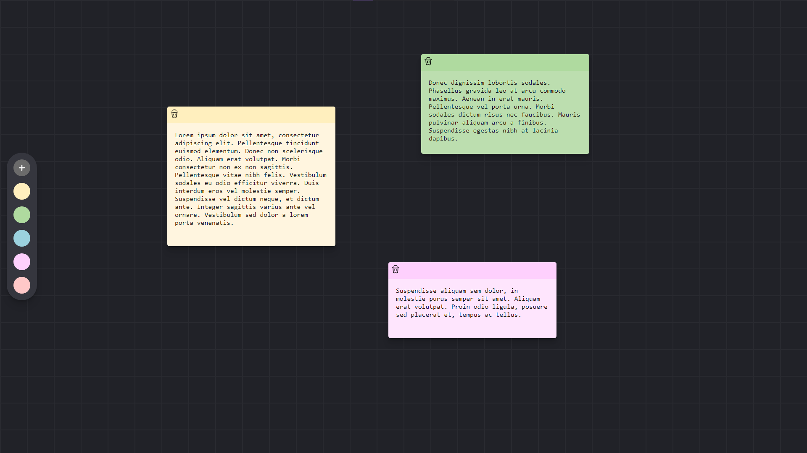

<div align="center" id="top">


<a href="https://github.com/KennedyBarreto/sticky-notes/blob/main/README.md">Versão em português</a> | 
 <a href="https://sticky-notes-psi-two.vercel.app/">Project Deploy</a></div>

<h1 align="center"> Sticky Notes - Note Block
 </h1>

<p align="center">
  

  

  

  

</p>

<p align="center">
  <a href="#dart-about">About</a> &#xa0; | &#xa0; 
  <a href="#sparkles-features">Features</a> &#xa0; | &#xa0;
  <a href="#rocket-technologies">Technologies</a> &#xa0; | &#xa0;
  <a href="#white_check_mark-prerequisites">Prerequisites</a> &#xa0; | &#xa0;
  <a href="#checkered_flag-getting-started">Getting Started</a> &#xa0; | &#xa0;
  <a href="#memo-license">License</a> &#xa0; | &#xa0;
  <a href="https://github.com/KennedyBarreto" target="_blank">Author</a>
</p>

<br>

## :dart: About

Interactive "Post-It" style note blocks. A Fullstack project built using React.js for the frontend and the [Appwrite](https://appwrite.io/) service for the backend. Based on a project by [freeCodeCamp.org](https://www.youtube.com/watch?v=yBThHM2pBbE)

## :sparkles: Features

:heavy_check_mark: Create notes and customize their colors; <br>
:heavy_check_mark: Drag and drop notes anywhere on the screen; <br>
:heavy_check_mark: Real-time storage and saving<br>

## :rocket: Technologies

The following tools were used to build this project:

- [HTML](https://developer.mozilla.org/en-US/docs/Web/HTML)
- [CSS](https://developer.mozilla.org/en-US/docs/Web/CSS)
- [JS](https://developer.mozilla.org/en-US/docs/Web/JavaScript)
- [ReactJS](https://react.dev/)
- [Appwrite](https://appwrite.io/)

## :white_check_mark: Prerequisites

1 - Make sure you have <a href="https://nodejs.org/en">Node.js 20</a> or higher installed on your machine, along with a code editor to modify configuration files.

2 - The project uses the [Appwrite](https://appwrite.io/) service as the backend. To replicate it locally, create a project on the platform. For detailed instructions, read the [documentation](https://appwrite.io/docs).

3 - In the project folder, there is an example environment variables file (.env). Create or rename this file and replace it with your Appwrite project details. These variables will handle the connection between the service and the application.

## :checkered_flag: Getting Started

1 - Clone/Copy the repository to your machine

2 - Install dependencies

```bash
npm i
```

3 - Start the React project

```bash
npm run dev
```

## :construction: Next Steps

- [X] Add informative Toasts
- [x] Confirmation for important actions
- [ ] Encrypt notes in the database
- [ ] Design improvements
- [ ] Optimization enhancements

## :memo: License

This project is under the MIT license. See the [LICENSE](LICENSE.md) file for more details.

Made with :heart: by <a href="https://github.com/KennedyBarreto" target="_blank">Kennedy Barreto</a>

&#xa0;

<a href="#top">Back to top</a>
